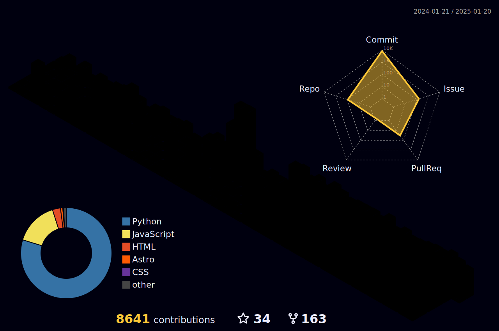

# HORRAY MY GITHUB ACTIONS ARE BACK!!!! 8/24/2024 9:55 AM PST

<p align="center"> <a href="https://octoprofile.vercel.app/user?id=Coding4Hours"></a> </p>
<p align="center"> <a href="https://komarev.com/ghpvc/?username=Coding4Hours" target="_blank" rel="noreferrer">  </a> </p>
<p align="center">
<a href="https://stackoverflow.com/users/coding4hours" target="blank"></a>
<a href="https://kaggle.com/pusheen meow" target="blank"></a>
<a href="https://www.youtube.com/c/hydrogennetwork" target="blank"></a>
</p>

<h3 id="tools" align="center">𝙻𝚊𝚗𝚐𝚞𝚊𝚐𝚎𝚜 𝚊𝚗𝚍 𝚃𝚘𝚘𝚕𝚜:</h3>
<p align="center">


</p>

<!--<p align="center"> <a href="https://discord.gg/Y3Amtwk27U"  ></img></a> </p>-->
<details  id="stats" align="center"><summary><h2>𝚂𝚝𝚊𝚝𝚜</h2></summary>


  ### 🔝 𝚃𝚘𝚙 𝙲𝚘𝚗𝚝𝚛𝚒𝚋𝚞𝚝𝚎𝚍 𝚁𝚎𝚙𝚘
  
<p align="center">

</p>


<br>
<!--  -->
</details>


<details align="center" id="games"><summary><h2>𝙿𝚛𝚘𝚏𝚒𝚕𝚎 𝙶𝚊𝚖𝚎𝚜</h2></summary>
  <!-- CONNECT4 -->
<details align="center"><summary><h2>Connect 4</h2></summary>
<table align="center">
<tr></tr>
<tr><td>
<p align="center"><b>A game of Connect 4 played on GitHub.</b><br>🔴 Click on a column to make a move. It is currently Red's turn. 🔴</p><p>

| [COL 0](https://github.com/Coding4Hours/Coding4Hours/issues/new?title=Connect4:+0&body=Please+do+not+change+the+title.+Just+click+"Submit+new+issue".+You+do+not+need+to+do+anything+else.+%3AD) | [COL 1](https://github.com/Coding4Hours/Coding4Hours/issues/new?title=Connect4:+1&body=Please+do+not+change+the+title.+Just+click+"Submit+new+issue".+You+do+not+need+to+do+anything+else.+%3AD) | [COL 2](https://github.com/Coding4Hours/Coding4Hours/issues/new?title=Connect4:+2&body=Please+do+not+change+the+title.+Just+click+"Submit+new+issue".+You+do+not+need+to+do+anything+else.+%3AD) | [COL 3](https://github.com/Coding4Hours/Coding4Hours/issues/new?title=Connect4:+3&body=Please+do+not+change+the+title.+Just+click+"Submit+new+issue".+You+do+not+need+to+do+anything+else.+%3AD) | [COL 4](https://github.com/Coding4Hours/Coding4Hours/issues/new?title=Connect4:+4&body=Please+do+not+change+the+title.+Just+click+"Submit+new+issue".+You+do+not+need+to+do+anything+else.+%3AD) | [COL 5](https://github.com/Coding4Hours/Coding4Hours/issues/new?title=Connect4:+5&body=Please+do+not+change+the+title.+Just+click+"Submit+new+issue".+You+do+not+need+to+do+anything+else.+%3AD) | [COL 6](https://github.com/Coding4Hours/Coding4Hours/issues/new?title=Connect4:+6&body=Please+do+not+change+the+title.+Just+click+"Submit+new+issue".+You+do+not+need+to+do+anything+else.+%3AD) | [COL 7](https://github.com/Coding4Hours/Coding4Hours/issues/new?title=Connect4:+7&body=Please+do+not+change+the+title.+Just+click+"Submit+new+issue".+You+do+not+need+to+do+anything+else.+%3AD) |
| :-: | :-: | :-: | :-: | :-: | :-: | :-: | :-: |
|  |  |  |  |  |  |  |  |
|  |  |  |  |  |  |  |  |
|  |  |  |  |  |  |  |  |
|  |  |  |  |  |  |  |  |
|  |  |  |  |  |  |  |  |
|  |  |  |  |  |  |  |  |


<details align="left"><summary><h3>History of moves for this game</h3></summary>

| Move | User |
| :-: | :-: |
| 🟡 Column 2 | [ @nhelchitnis](https://github.com/nhelchitnis) |
| 🔴 Column 4 | [ @Coding4Hours](https://github.com/Coding4Hours) |
| 🟡 Column 3 | [ @](https://github.com/) |
| 🔴 Column 5 | [ @](https://github.com/) |

</details>

<details align="left"><summary><h3>Most active players</h3></summary>

| Moves | User |
| :-: | :-: |
| 2 | [ @](https://github.com/) |
| 1 | [ @Coding4Hours](https://github.com/Coding4Hours) |
| 1 | [ @nhelchitnis](https://github.com/nhelchitnis) |

</details>

<details align="left"><summary><h3>Stats</h3></summary>

| Stat | Value |
| :-: | :-: |
| Red Wins | 0 |
| Yellow Wins | 0 |

</details>
</td></tr>
</table>
</details>
<!-- CONNECT4 -->
<!-- OTHELLO -->
<details align="center" id="game2"><summary><h2>𝙾𝚝𝚑𝚎𝚕𝚕𝚘</h2></summary>
<table align="center">
<tr></tr>
<tr><td>
<p align="center"><b>𝙰 𝚐𝚊𝚖𝚎 𝚘𝚏 𝙾𝚝𝚑𝚎𝚕𝚕𝚘 𝚙𝚕𝚊𝚢𝚎𝚍 𝚘𝚗 𝙶𝚒𝚝𝙷𝚞𝚋.</b><br>𝙲𝚕𝚒𝚌𝚔 𝚘𝚗 𝚊 𝚠𝚑𝚒𝚝𝚎 𝚍𝚘𝚝 𝚝𝚘 𝚖𝚊𝚔𝚎 𝚢𝚘𝚞𝚛 𝚖𝚘𝚟𝚎.<br>𝙱𝚕𝚞𝚎 𝚑𝚊𝚜 𝟼 𝚙𝚒𝚎𝚌𝚎𝚜. 𝙶𝚛𝚎𝚎𝚗 𝚑𝚊𝚜 𝟺 𝚙𝚒𝚎𝚌𝚎𝚜.<br>🔵 𝙸𝚝 𝚒𝚜 𝚌𝚞𝚛𝚛𝚎𝚗𝚝𝚕𝚢 𝙱𝚕𝚞𝚎'𝚜 𝚝𝚞𝚛𝚗. 🔵</p><p>

|  | A | B | C | D | E | F | G | H |
| :-: | :-: | :-: | :-: | :-: | :-: | :-: | :-: | :-: |
| 0 |  |  |  |  |  |  |  |  |
| 1 |  |  |  |  |  |  |  |  |
| 2 |  |  | <a href='https://github.com/Coding4Hours/Coding4Hours/issues/new?title=Othello:+C2&body=Please+do+not+change+the+title.+Just+click+"Submit+new+issue".+You+do+not+need+to+do+anything+else.+%3AD'></a> |  |  |  | <a href='https://github.com/Coding4Hours/Coding4Hours/issues/new?title=Othello:+G2&body=Please+do+not+change+the+title.+Just+click+"Submit+new+issue".+You+do+not+need+to+do+anything+else.+%3AD'></a> |  |
| 3 |  | <a href='https://github.com/Coding4Hours/Coding4Hours/issues/new?title=Othello:+B3&body=Please+do+not+change+the+title.+Just+click+"Submit+new+issue".+You+do+not+need+to+do+anything+else.+%3AD'></a> |  |  |  |  | <a href='https://github.com/Coding4Hours/Coding4Hours/issues/new?title=Othello:+G3&body=Please+do+not+change+the+title.+Just+click+"Submit+new+issue".+You+do+not+need+to+do+anything+else.+%3AD'></a> |  |
| 4 |  |  |  |  |  | <a href='https://github.com/Coding4Hours/Coding4Hours/issues/new?title=Othello:+F4&body=Please+do+not+change+the+title.+Just+click+"Submit+new+issue".+You+do+not+need+to+do+anything+else.+%3AD'></a> | <a href='https://github.com/Coding4Hours/Coding4Hours/issues/new?title=Othello:+G4&body=Please+do+not+change+the+title.+Just+click+"Submit+new+issue".+You+do+not+need+to+do+anything+else.+%3AD'></a> |  |
| 5 |  |  | <a href='https://github.com/Coding4Hours/Coding4Hours/issues/new?title=Othello:+C5&body=Please+do+not+change+the+title.+Just+click+"Submit+new+issue".+You+do+not+need+to+do+anything+else.+%3AD'></a> | <a href='https://github.com/Coding4Hours/Coding4Hours/issues/new?title=Othello:+D5&body=Please+do+not+change+the+title.+Just+click+"Submit+new+issue".+You+do+not+need+to+do+anything+else.+%3AD'></a> |  |  |  |  |
| 6 |  |  |  |  | <a href='https://github.com/Coding4Hours/Coding4Hours/issues/new?title=Othello:+E6&body=Please+do+not+change+the+title.+Just+click+"Submit+new+issue".+You+do+not+need+to+do+anything+else.+%3AD'></a> |  |  |  |
| 7 |  |  |  |  |  |  |  |  |


<details align="left"><summary><h3>𝙷𝚒𝚜𝚝𝚘𝚛𝚢 𝚘𝚏 𝚖𝚘𝚟𝚎𝚜 𝚏𝚘𝚛 𝚝𝚑𝚒𝚜 𝚐𝚊𝚖𝚎</h3></summary>

| Move | User |
| :-: | :-: |
| 🟢 E5 | [ @Coding4Hours](https://github.com/Coding4Hours) |
| 🔵 E2 | [ @Coding4Hours](https://github.com/Coding4Hours) |
| 🟢 F3 | [ @Coding4Hours](https://github.com/Coding4Hours) |
| 🔵 F2 | [ @Coding4Hours](https://github.com/Coding4Hours) |
| 🟢 C3 | [ @Coding4Hours](https://github.com/Coding4Hours) |
| 🔵 C4 | [ @Coding4Hours](https://github.com/Coding4Hours) |

</details>

<details align="left"><summary><h3>𝙼𝚘𝚜𝚝 𝚊𝚌𝚝𝚒𝚟𝚎 𝚙𝚕𝚊𝚢𝚎𝚛𝚜</h3></summary>

| Moves | User |
| :-: | :-: |
| 6 | [ @Coding4Hours](https://github.com/Coding4Hours) |

</details>

<details align="left"><summary><h3>𝚂𝚝𝚊𝚝𝚜</h3></summary>

| Stat | Value |
| :-: | :-: |
| Blue Wins | 0 |
| Green Wins | 0 |

</details>
</td></tr>
</table>
</details>
<!-- OTHELLO -->

<details id="game3" align="center"><summary><h2>𝙲𝚑𝚎𝚜𝚜</h2></summary>
𝙸𝚝'𝚜 𝚢𝚘𝚞𝚛 𝚝𝚞𝚛𝚗 𝚝𝚘 𝚙𝚕𝚊𝚢! 𝙼𝚘𝚟𝚎 𝚊 <!-- BEGIN TURN -->black<!-- END TURN --> piece.

<!-- BEGIN CHESS BOARD -->
|   | H | G | F | E | D | C | B | A |   |
|---|:-:|:-:|:-:|:-:|:-:|:-:|:-:|:-:|:-:|
| **1** |  |  |  |  |  |  |  |  | **1** |
| **2** |  |  |  |  |  |  |  |  | **2** |
| **3** |  |  |  |  |  |  |  |  | **3** |
| **4** |  |  |  |  |  |  |  |  | **4** |
| **5** |  |  |  |  |  |  |  |  | **5** |
| **6** |  |  |  |  |  |  |  |  | **6** |
| **7** |  |  |  |  |  |  |  |  | **7** |
| **8** |  |  |  |  |  |  |  |  | **8** |
|   | **H** | **G** | **F** | **E** | **D** | **C** | **B** | **A** |   |
<!-- END CHESS BOARD -->

**It's your turn to move! Choose one from the following table**
<!-- BEGIN MOVES LIST -->
|  FROM  | TO (Just click a link!) |
| :----: | :---------------------- |
| **A7** | [A5](https://github.com/Coding4Hours/Coding4Hours/issues/new?body=Please+do+not+change+the+title.+Just+click+%22Submit+new+issue%22.+You+don%27t+need+to+do+anything+else+%3AD&title=Chess%3A+Move+A7+to+A5), [A6](https://github.com/Coding4Hours/Coding4Hours/issues/new?body=Please+do+not+change+the+title.+Just+click+%22Submit+new+issue%22.+You+don%27t+need+to+do+anything+else+%3AD&title=Chess%3A+Move+A7+to+A6) |
| **B7** | [B5](https://github.com/Coding4Hours/Coding4Hours/issues/new?body=Please+do+not+change+the+title.+Just+click+%22Submit+new+issue%22.+You+don%27t+need+to+do+anything+else+%3AD&title=Chess%3A+Move+B7+to+B5), [B6](https://github.com/Coding4Hours/Coding4Hours/issues/new?body=Please+do+not+change+the+title.+Just+click+%22Submit+new+issue%22.+You+don%27t+need+to+do+anything+else+%3AD&title=Chess%3A+Move+B7+to+B6) |
| **B8** | [A6](https://github.com/Coding4Hours/Coding4Hours/issues/new?body=Please+do+not+change+the+title.+Just+click+%22Submit+new+issue%22.+You+don%27t+need+to+do+anything+else+%3AD&title=Chess%3A+Move+B8+to+A6), [C6](https://github.com/Coding4Hours/Coding4Hours/issues/new?body=Please+do+not+change+the+title.+Just+click+%22Submit+new+issue%22.+You+don%27t+need+to+do+anything+else+%3AD&title=Chess%3A+Move+B8+to+C6) |
| **C7** | [C5](https://github.com/Coding4Hours/Coding4Hours/issues/new?body=Please+do+not+change+the+title.+Just+click+%22Submit+new+issue%22.+You+don%27t+need+to+do+anything+else+%3AD&title=Chess%3A+Move+C7+to+C5), [C6](https://github.com/Coding4Hours/Coding4Hours/issues/new?body=Please+do+not+change+the+title.+Just+click+%22Submit+new+issue%22.+You+don%27t+need+to+do+anything+else+%3AD&title=Chess%3A+Move+C7+to+C6) |
| **D7** | [D5](https://github.com/Coding4Hours/Coding4Hours/issues/new?body=Please+do+not+change+the+title.+Just+click+%22Submit+new+issue%22.+You+don%27t+need+to+do+anything+else+%3AD&title=Chess%3A+Move+D7+to+D5), [D6](https://github.com/Coding4Hours/Coding4Hours/issues/new?body=Please+do+not+change+the+title.+Just+click+%22Submit+new+issue%22.+You+don%27t+need+to+do+anything+else+%3AD&title=Chess%3A+Move+D7+to+D6) |
| **E7** | [E5](https://github.com/Coding4Hours/Coding4Hours/issues/new?body=Please+do+not+change+the+title.+Just+click+%22Submit+new+issue%22.+You+don%27t+need+to+do+anything+else+%3AD&title=Chess%3A+Move+E7+to+E5), [E6](https://github.com/Coding4Hours/Coding4Hours/issues/new?body=Please+do+not+change+the+title.+Just+click+%22Submit+new+issue%22.+You+don%27t+need+to+do+anything+else+%3AD&title=Chess%3A+Move+E7+to+E6) |
| **F7** | [F5](https://github.com/Coding4Hours/Coding4Hours/issues/new?body=Please+do+not+change+the+title.+Just+click+%22Submit+new+issue%22.+You+don%27t+need+to+do+anything+else+%3AD&title=Chess%3A+Move+F7+to+F5), [F6](https://github.com/Coding4Hours/Coding4Hours/issues/new?body=Please+do+not+change+the+title.+Just+click+%22Submit+new+issue%22.+You+don%27t+need+to+do+anything+else+%3AD&title=Chess%3A+Move+F7+to+F6) |
| **G7** | [G5](https://github.com/Coding4Hours/Coding4Hours/issues/new?body=Please+do+not+change+the+title.+Just+click+%22Submit+new+issue%22.+You+don%27t+need+to+do+anything+else+%3AD&title=Chess%3A+Move+G7+to+G5), [G6](https://github.com/Coding4Hours/Coding4Hours/issues/new?body=Please+do+not+change+the+title.+Just+click+%22Submit+new+issue%22.+You+don%27t+need+to+do+anything+else+%3AD&title=Chess%3A+Move+G7+to+G6) |
| **G8** | [F6](https://github.com/Coding4Hours/Coding4Hours/issues/new?body=Please+do+not+change+the+title.+Just+click+%22Submit+new+issue%22.+You+don%27t+need+to+do+anything+else+%3AD&title=Chess%3A+Move+G8+to+F6), [H6](https://github.com/Coding4Hours/Coding4Hours/issues/new?body=Please+do+not+change+the+title.+Just+click+%22Submit+new+issue%22.+You+don%27t+need+to+do+anything+else+%3AD&title=Chess%3A+Move+G8+to+H6) |
| **H7** | [H5](https://github.com/Coding4Hours/Coding4Hours/issues/new?body=Please+do+not+change+the+title.+Just+click+%22Submit+new+issue%22.+You+don%27t+need+to+do+anything+else+%3AD&title=Chess%3A+Move+H7+to+H5), [H6](https://github.com/Coding4Hours/Coding4Hours/issues/new?body=Please+do+not+change+the+title.+Just+click+%22Submit+new+issue%22.+You+don%27t+need+to+do+anything+else+%3AD&title=Chess%3A+Move+H7+to+H6) |
<!-- END MOVES LIST -->

𝙷𝚊𝚟𝚒𝚗𝚐 𝚏𝚞𝚗? 𝙰𝚜𝚔 𝚊 𝚏𝚛𝚒𝚎𝚗𝚍 𝚝𝚘 𝚍𝚘 𝚝𝚑𝚎 𝚗𝚎𝚡𝚝 𝚖𝚘𝚟𝚎!

<details>
  <summary>𝙻𝚊𝚜𝚝 𝟻 𝚖𝚘𝚟𝚎𝚜 𝚒𝚗 𝚝𝚑𝚒𝚜 𝚐𝚊𝚖𝚎</summary>
<!-- BEGIN LAST MOVES -->

| Move | Author |
| :--: | :----- |
| `F2` to `F4` | [ @Coding4Hours](https://github.com/Coding4Hours) |
| `Start game` | [ @Coding4Hours](https://github.com/Coding4Hours) |

<!-- END LAST MOVES -->
</details>

<details>
  <summary>𝚃𝚘𝚙 𝟷0 𝚖𝚘𝚜𝚝 𝚖𝚘𝚟𝚎𝚜 𝚊𝚌𝚛𝚘𝚜𝚜 𝚊𝚕𝚕 𝚐𝚊𝚖𝚎𝚜'</summary>
<!-- BEGIN TOP MOVES -->

| Total moves |  User  |
| :---------: | :----- |
| 1 | [@Coding4Hours](https://github.com/Coding4Hours) |

<!-- END TOP MOVES -->
</details>
</details>
</details>

<details id="insights" align="center">
	<summary><h2>𝙸𝚗𝚜𝚒𝚐𝚑𝚝𝚜</h2></summary>

<a href="https://github.com/marketplace/actions/quote-readme">
<!--STARTS_HERE_QUOTE_README-->
<i>❝“The more you know, the more you realize you know nothing.”— Socrates   ❞</i>
<!--ENDS_HERE_QUOTE_README-->
</a>

###   𝙷𝚎𝚛𝚎'𝚜 𝚜𝚘𝚖𝚎 𝚑𝚞𝚖𝚘𝚛 𝚏𝚘𝚛 𝚢𝚘𝚞:

</details>

<details align='center'><summary><h2>𝚆𝚊𝚗𝚗𝚊 𝚜𝚎𝚎 𝚊 𝚖𝚊𝚐𝚒𝚌 𝚝𝚛𝚒𝚌𝚔?</summary>
<details><summary><h2>𝙽𝚞𝚖𝚋𝚎𝚛 𝚃𝚛𝚒𝚌𝚔</h2></summary>
	𝙸 𝚠𝚊𝚗𝚝 𝚢𝚘𝚞 𝚝𝚘 𝚝𝚑𝚒𝚗𝚔 𝚘𝚏 𝚊 𝚗𝚞𝚖𝚋𝚎𝚛. 𝚃𝚑𝚎𝚗 𝚙𝚛𝚎𝚜𝚜 𝚊𝚗𝚜𝚠𝚎𝚛.
	<details><summary>𝙰𝚗𝚜𝚠𝚎𝚛</summary>
		<h2>𝚈𝚘𝚞𝚛 𝚊𝚗𝚜𝚠𝚎𝚛 𝚑𝚊𝚜 𝚎𝚒𝚝𝚑𝚎𝚛 𝟹 𝚘𝚛 𝟽 𝚘𝚛 𝚋𝚘𝚝𝚑</h2>
	</details>
</details>
</details>
	
<div align="center">
<a  alt="𝚂𝚙𝚘𝚝𝚒𝚏𝚢" href="https://data-card-for-spotify.herokuapp.com/card?user_id=31wp7synce55dmtksfghfxg3hq34">  </a>
</div>


 
---
	
 ### 𝙾𝚗 𝚖𝚢 𝚋𝚕𝚘𝚐
 
 <!-- blog starts -->
* [IM BACK!!!](http://coding4hours.duckdns.org/first/post/2024/08/24/IM-BACK!!!!!.html) - 2024-08-24
* [Hello World!](http://coding4hours.duckdns.org/first/post/2024/07/07/Hello-World!.html) - 2024-07-07
* [Welcome to Jekyll!](http://coding4hours.duckdns.org/first/post/2024/07/06/Welcome-to-my-blog.html) - 2024-07-06
<!-- blog ends -->
 𝙼𝚘𝚛𝚎 𝚘𝚗 [𝙼𝚢 𝚋𝚕𝚘𝚐](https://coding4hours.github.io)
 
 <!--START_SECTION:waka-->

```txt
No activity tracked
```

<!--END_SECTION:waka-->
 
<!--START_SECTION:activity-->
1. ❌ Closed PR [#8](https://github.com/Aluben-service/Aluben-Node/pull/8) in [Aluben-service/Aluben-Node](https://github.com/Aluben-service/Aluben-Node)
2. 🗣 Commented on [#8](https://github.com/Aluben-service/Aluben-Node/pull/8#issuecomment-2303537424) in [Aluben-service/Aluben-Node](https://github.com/Aluben-service/Aluben-Node)
3. 💪 Opened PR [#8](https://github.com/Aluben-service/Aluben-Node/pull/8) in [Aluben-service/Aluben-Node](https://github.com/Aluben-service/Aluben-Node)
4. 💪 Opened PR [#5351](https://github.com/TheAlgorithms/Java/pull/5351) in [TheAlgorithms/Java](https://github.com/TheAlgorithms/Java)
5. 🎉 Merged PR [#6](https://github.com/Aluben-service/Aluben-Node/pull/6) in [Aluben-service/Aluben-Node](https://github.com/Aluben-service/Aluben-Node)
5. 🗣 Commented on [#4084](https://github.com/microsoft/WSL/issues/4084#issuecomment-2211148242) in [microsoft/WSL](https://github.com/microsoft/WSL)
<!--END_SECTION:activity-->


## 

## Current Board

|  |  | X |
|---|---|---|
|  |  |  |
|  |  |  |

Possible moves:

- [Move 1](https://github.com/Coding4Hours/Coding4Hours/issues/new?title=move%201)
- [Move 2](https://github.com/Coding4Hours/Coding4Hours/issues/new?title=move%202)
- [Move 3](https://github.com/Coding4Hours/Coding4Hours/issues/new?title=move%203)
- [Move 4](https://github.com/Coding4Hours/Coding4Hours/issues/new?title=move%204)
- [Move 5](https://github.com/Coding4Hours/Coding4Hours/issues/new?title=move%205)
- [Move 6](https://github.com/Coding4Hours/Coding4Hours/issues/new?title=move%206)
- [Move 7](https://github.com/Coding4Hours/Coding4Hours/issues/new?title=move%207)
- [Move 8](https://github.com/Coding4Hours/Coding4Hours/issues/new?title=move%208)
- [Move 9](https://github.com/Coding4Hours/Coding4Hours/issues/new?title=move%209)
  
